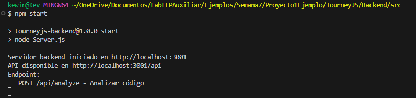
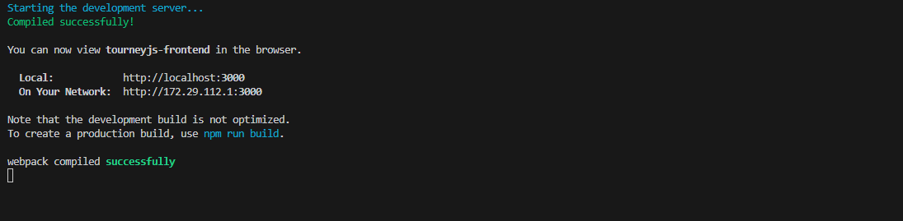
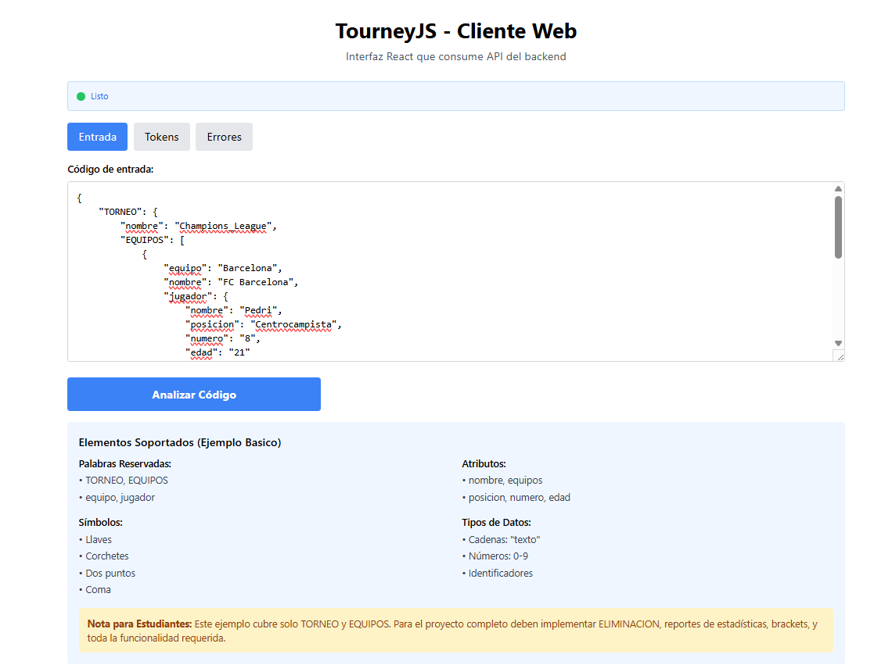
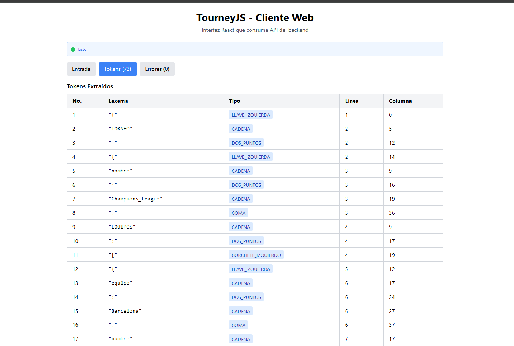
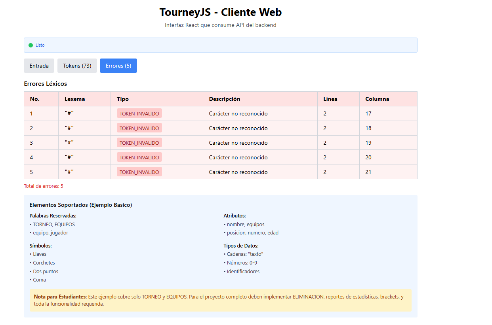

# TourneyJS - Guía de Uso

Esta guía te ayudará a instalar, levantar y probar el proyecto TourneyJS (Backend y Frontend) paso a paso, para que cualquier persona pueda ejecutarlo sin errores.

---

## Requisitos Previos
- Node.js (v18 o superior recomendado)
- npm (v8 o superior)
- Git (para clonar el repositorio)

---

## Instalación

### 1. Clona o descarga el proyecto

```bash
# Clona el repositorio
git clone <URL_DEL_REPOSITORIO>
cd <CARPETA_DEL_PROYECTO>
```

### 2. Instala dependencias del Backend

```bash
cd TourneyJS/Backend/src
npm install
```

### 3. Instala dependencias del Frontend

```bash
cd ../../Frontend/src/tourneyjs-frontend
npm install
```

---

## Ejecución

### 1. Levanta el Backend

```bash
cd TourneyJS/Backend/src
npm start
```

- El backend se ejecuta en `http://localhost:3001` por defecto.
- Verifica que no haya errores en la terminal.



### 2. Levanta el Frontend

Abre una nueva terminal y ejecuta:

```bash
cd TourneyJS/Frontend/src/tourneyjs-frontend
npm start
```

- El frontend se ejecuta en `http://localhost:3000`.
- Se abrirá automáticamente en tu navegador.






---

## Pruebas Básicas

1. Ingresa código de ejemplo en el área de texto del frontend.
2. Haz clic en "Analizar Código" para probar la comunicación con el backend.
3. Verifica que se muestren los tokens y errores correctamente.

---

## Solución de Problemas

- Si ves una pantalla en blanco, revisa la consola del navegador y la terminal por errores.
- Asegúrate de que ambos servidores (backend y frontend) estén corriendo.
- Verifica que el archivo `public/index.html` del frontend contenga `<div id="root"></div>`.
- Si Tailwind no aplica estilos, revisa que `index.css` esté importado en `index.jsx` y que las dependencias estén instaladas.

---

## Estructura del Proyecto

```
TourneyJS/
  Backend/
    src/
      Server.js
      LexicalAnalyzar.js
      package.json
      ...
  Frontend/
    src/
      tourneyjs-frontend/
        public/
          index.html
        src/
          index.jsx
          TourneyJSClient.jsx
          index.css
        package.json
```

---

## Notas Adicionales
- El backend debe estar corriendo antes de usar el frontend.
- Si cambias puertos, actualiza las URLs en el frontend.
- Para desarrollo, puedes modificar los componentes React y el backend según lo que necesites realizar.
- La manera en la que estoy probando lo que el analizador léxico hace es ingresando código de ejemplo en el área de texto del frontend y haciendo clic en "Analizar Código". 
---
